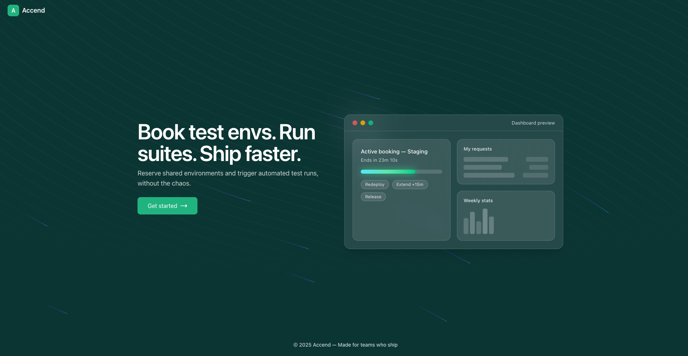

# Accend

A demo platform to request access to environments, book short-term environment locks, and trigger simulated runs. Built with a Next.js client and a Fastify + Mercurius GraphQL API.

## Features

- Environment booking (availability, duration, extend/release)
- Request workflow with admin approvals/denials and expiry windows
- My requests and admin-wide request views with filtering
- Active booking controls (release, extend) and weekly usage charts
- Demo accounts for instant view (one‑click sign-in)

## Screenshots




## Tech Stack

- Web: Next.js (App Router), Apollo Client, shadcn/ui, Recharts
- API: Fastify, Mercurius (GraphQL), Zod, JWT cookie auth
- Data: MongoDB (users, requests, bookings)

## Prerequisites

- Node.js 18+
- npm or pnpm
- MongoDB (local or MongoDB Atlas)

## Getting Started

1) Clone

```bash
git clone <repo-url>
cd accend
```

2) Server (API)

Create `server/.env` (example):

```bash
MONGO_URI=mongodb://127.0.0.1:27017
MONGO_DB=accend
CORS_ORIGIN=http://localhost:3000
COOKIE_SECURE=false
JWT_SECRET=dev_secret_change_me
PORT=4000
```

Install & run:

```bash
cd server
npm install
npm run dev
```

The server will:
- Connect to MongoDB and create indexes
- Seed demo accounts (Admin/Developer/QA)
- Start on http://localhost:4000/graphql

3) Client (Web)

In a separate terminal:

```bash
cd client
npm install
export NEXT_PUBLIC_GRAPHQL_URL=http://localhost:4000/graphql
npm run dev
```

Open http://localhost:3000

### Demo accounts (one‑click)

- Admin: `admin.demo@accend.app` / `demo1234`
- Developer: `dev.demo@accend.app` / `demo1234`
- QA Engineer: `qa.demo@accend.app` / `demo1234`

Use the “Try demo accounts” section on the login page to sign in instantly.

## Environment variables

Server (`server/.env`)
- `MONGO_URI` Mongo connection string
- `MONGO_DB` Database name
- `CORS_ORIGIN` Allowed frontend origin (comma-separated origins supported if you enable it)
- `COOKIE_SECURE` `true` in production
- `JWT_SECRET` Strong secret for JWT signing
- `PORT` Port to bind, default 4000

Client (`client`)
- `NEXT_PUBLIC_GRAPHQL_URL` Full GraphQL endpoint, e.g. `https://your-api.example.com/graphql`

## Deployment

- API: any Node host (Railway/Fly/Render). Bind to `0.0.0.0:$PORT`. Set env vars above. Ensure CORS_ORIGIN is your client URL and cookies are `SameSite=None; Secure` in production.
- Web: Vercel/Netlify/Static. Set `NEXT_PUBLIC_GRAPHQL_URL` to your deployed API `/graphql` URL.

## Scripts

Server
```bash
npm run dev   
npm run build
npm run start   
```

Client
```bash
npm run dev 
npm run build 
npm run start   
```

## Project structure

```
accend/
  client/        # Next.js app (App Router) + UI
  server/        # Fastify + GraphQL API
```

